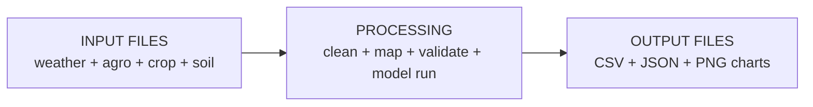
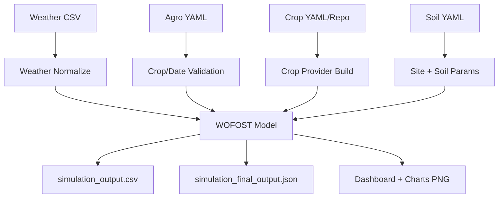

# Full Explain v2: `run_wofost_COMPLETE.py`

Ye document beginner-friendly Hindi/Hinglish me hai.  
Goal: aapko clearly samajh aaye ki script kya karti hai, kaise karti hai, aur output ka matlab kya hai.

## 1. Script ka main kaam
`run_wofost_COMPLETE.py` ek complete simulation pipeline hai:
1. Input files read karta hai.
2. Data normalize/validate karta hai.
3. WOFOST model run karta hai.
4. Final results print karta hai.
5. CSV/JSON/plots save karta hai.

## 2. Folder structure (aapke project ke hisaab se)
```text
wofost/
  run_wofost_COMPLETE.py
  agromanagement/agro.yaml
  weather/weather_pcse_2014_2034.csv
  crop/winter_wheat.yaml
  soil/soil.yaml
  _runtime/                      # script automatically banata hai
```

## 3. Input -> Processing -> Output (Visual)


Aur detail flow:


## 4. Script step-by-step (simple language)
1. Script start hota hai, banner print hota hai.
2. CLI options parse hoti hain (`--weather`, `--agro`, `--crop-file`, etc.).
3. Weather file choose hoti hai:
   - pehle `weather_pcse_2014_2034.csv`
   - fir `weather.csv`
   - agar multiple ambiguous files hui to explicit path maangta hai.
4. Weather preprocessing hota hai:
   - date formats normalize
   - station metadata clean
   - VAP scaling fix (jab high scale ho)
   - PCSE-compatible clean file `_runtime/weather_prepared_pcse.csv` banta hai.
5. Agro file load hoti hai aur weather date range se compare hoti hai.
6. Crop mapping hota hai:
   - `winter_wheat` ko internally `wheat` mapping
   - `winter_wheat` variety ko `Winter_wheat_101` map
7. Crop source resolve hota hai:
   - local crop repo agar ready hai to use
   - warna single crop YAML (`winter_wheat.yaml`) ko temporary repo banake use
   - local fail ho to remote official repo fallback
8. Soil YAML se site + soil params extract hote hain.
9. Model run hota hai (`Wofost72_WLP_FD`).
10. Final day ke metrics print hote hain.
11. Files save hoti hain:
   - `simulation_output.csv`
   - `simulation_final_output.csv`
   - `simulation_final_output.json`
12. Visual plots bante hain:
   - `simulation_dashboard.png`
   - `simulation_key_metrics.png`
   - `simulation_pipeline_flowchart.png`

## 5. Important terms (non-coder quick glossary)
- `TWSO`: grain yield (storage organ yield)
- `TAGP`: above-ground biomass
- `TWRT`: root biomass
- `DVS`: crop development stage (0 to 2 typical)
- `LAI`: leaf area index
- `SM`: soil moisture
- `TRA`: transpiration

## 6. Output files ka matlab
- `simulation_output.csv`: daily time-series data.
- `simulation_final_output.csv`: sirf final day summary.
- `simulation_final_output.json`: same final summary in JSON format.
- `simulation_dashboard.png`: multi-panel visual dashboard.
- `simulation_key_metrics.png`: key trends.
- `simulation_pipeline_flowchart.png`: process flow image.

## 7. Kaise run karein
Default run:
```powershell
.\venv\Scripts\python.exe run_wofost_COMPLETE.py
```

Explicit run (recommended when testing paths):
```powershell
.\venv\Scripts\python.exe run_wofost_COMPLETE.py --weather weather\weather_pcse_2014_2034.csv --crop-file crop\winter_wheat.yaml --agro agromanagement\agro.yaml --soil-file soil\soil.yaml
```

## 8. Useful options
- `--use-remote-crop`: local crop ki jagah official online crop parameters.
- `--use-dummy-soil`: local soil file ki jagah dummy soil.
- `--crop-name`, `--variety-name`: manual override.

## 9. Typical run checklist
1. `weather`, `agromanagement`, `crop`, `soil` files updated hain.
2. command run karo.
3. console me `Simulation completed!` check karo.
4. `simulation_final_output.json` open karo.
5. PNG charts dekhkar sanity-check karo.

## 10. Common problems and quick fixes
1. Problem: weather parse error.
   Fix: weather CSV me `DAY,IRRAD,TMIN,TMAX,VAP,WIND,RAIN,SNOWDEPTH` columns check karo.
2. Problem: crop not found.
   Fix: `--crop-file crop\winter_wheat.yaml` pass karo, ya crop naming mapping verify karo.
3. Problem: zero yield.
   Fix: agro dates, crop variety, irrigation timing, DVS progression check karo.
4. Problem: date mismatch warnings.
   Fix: `crop_start_date`/`crop_end_date` weather range ke andar rakho.

## 11. Ek line me summary
Ye script aapke raw agri data ko leke, automatically clean karta hai, WOFOST se simulate karta hai, aur easy-to-read numeric + visual outputs deta hai.
